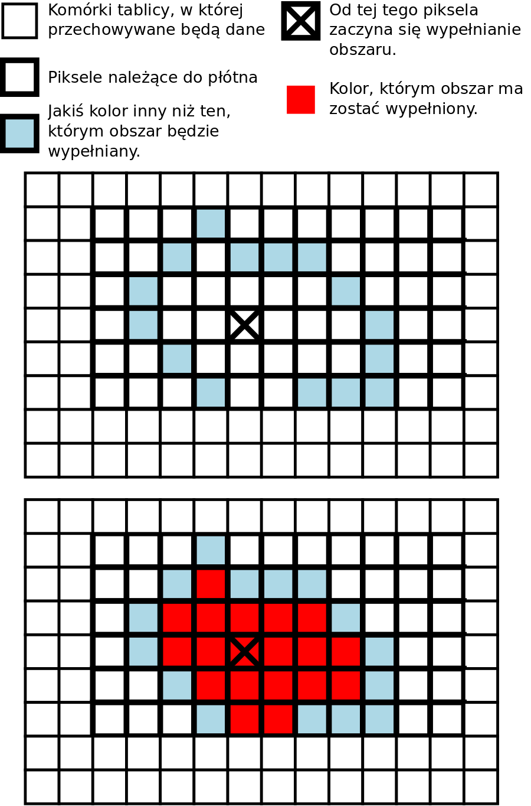

# Zadanie 05

## Idea

Zapewne używali Państwo kiedyś programu graficznego. Jedną z typowych możliwości takiego programu jest wypełnianie obszarów danym kolorem. Obszar do wypełnienia zazwyczaj jest mniejszy od całego płótna, na którym rysujemy, bo ograniczają go wcześniej naniesione kolory.

Tym razem Państwa zadaniem jest napisanie klasy, której metoda pozwoli na wypełnianie obszarów zadanym kolorem.

Gdzie jest haczyk? Cóż... płótno będzie posiadać wyłącznie metodę pozwalającą na pomalowanie piksela odpowiednim kolorem, ale nie będzie mieć metody umożliwiającej odczyt kolorów!

## Czy sprawa jest beznadziejna?

Na szczęście w tunelu jest małe światełko - są nim Wyjątki! Za ich pomocą można będzie się dowiedzieć kiedy rysując wyjdziemy poza krawędzie obrazka oraz kiedy napotkamy granicę.

## Poruszanie się po płótnie

Zakładamy, że będąc na pozycji \[col,row\] można się (próbować) przesunąć tylko na 4 pozycje sąsiednie:

```text
[ col + 1, row ]
[ col - 1, row ]
[ col, row - 1 ]
[ col, row + 1 ]
```

## Płótno

Dla uproszczenia zakładamy, że płótno będzie prostokątne.

Idea zamalowywania jego fragmentu pokazana jest na rysunku poniżej.



Wypełniany jest obszar, który ogranicza rozmiar płótna oraz innych kolorów. Oczywiście nadal należy pamiętać o tym, że nie do każdego piksela można dotrzeć poruszając się w podany w zadaniu sposób.

## UWAGI

Zabronione jest skanowanie całego płótna - nie wolno pobierać informacji o pikselach, do których wg. zasad poruszania się po planszy nie można dotrzeć.

Jeśli metoda setColor doprowadza do pojawienia wyjątku BorderColorException poprzedni kolor został nadpisany przez nowy - należy przywrócić stan poprzedni.

## Dostarczenie rozwiązania

Proszę o dostarczenie kodu klasy o nazwie `Graphics` implementującej interfejs `GraphicsInterface`.
