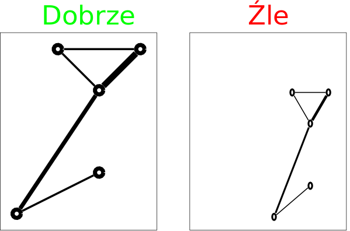

# Zadanie 09

## Idea

Zadanie polega na napisaniu aplikacji z interfejsem graficznym. Program ma odczytać z pliku tekstowego dane o pewnym grafie i narysować go z uwzględnieniem wag poszczególnych krawędzi.

## Format zapisu danych o grafie

Format zapisu danych grafu jest następujący:

```text
liczba węzłów N
N x [ pozycja węzła w postaci kolumna wiersz ]
liczba krawędzi K
K x [ numer węzła numer węzła waga ]
linia bez danych
```

Dla uproszczenia zakładamy, że pozycje są liczbami całkowitymi. Wagi to liczby nieujemne, całkowite. Wagi mogą być dowolne np. w poniższym przykładzie zamiast wag 10, 20, 30 mogą pojawić się np. 1000, 2000, 3000.

## Przykład

```text
5
1 1
3 2
3 4
2 5
4 5
5
1 2 10
1 3 20
3 4 10
4 5 10
3 5 30
```

Zakodowany w przykładzie graf wygląda następująco.



## Uwagi

- Należy prawidłowo wyznaczyć pozycję punktów - standardowy układ ekranu graficznego jest taki, że pozycja (0,0) zajmuje lewy-górny (a nie lewy-dolny) róg ekranu.
- Wagi dla poszczególnych krawędzi należy oznaczyć na obrazku za pomocą grubości linii (trzeba poeksperymentować, aby wszystkie krawędzie były widoczne).
- Rysunek ma wypełniać maksymalnie okno (z zachowaniem proporcji). Okno musi mieć możliwość zmiany rozmiaru. Wygląd taki jak na rysunku po stronie prawej jest zły. Obrazek z grafem ma się prawidłowo skalować.
- Plik, z którego pobrane zostaną dane do wyświetlania ma zostać wybrany po naciśnięciu przycisku "Load". Do wyboru pliku należy posłużyć się JFileChooser.
- Ponowne kliknięcie przycisku ma doprowadzić do możliwości załadowania i wyświetlania zawartości innego pliku.
- W rozwiązaniu używać można wyłącznie Swing-u (nie JavaFX).

## Dostarczenie rozwiązania

Państwa program ma uruchamiać klasa o nazwie `Start` (trzeba ją dostarczyć). Ma ona posiadać metodę main. Program jak zwykle dostarczony ma być za pomocą jednego pliku, ale tylko klasa Start może być klasą publiczną, bo przed kompilacją nazwa pliku zostanie zmieniona na Start.
